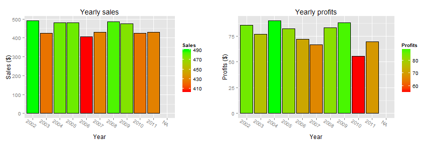

# Proprietary Business Dashboard example by ContextBase

Last updated on: 2015-11-03 11:34:55


```
## Warning in loop_apply(n, do.ply): Removed 10 rows containing missing values
## (position_stack).
```

```
## Warning in loop_apply(n, do.ply): Removed 10 rows containing missing values
## (position_stack).
```

 

Some additional text to add context to the KPI interpretation.
The .R file:

library(knitr)
library(ggplot2)
library(gridExtra)

## load the data


```r
# library(xlsx)
# dataset<-read.xlsx('dataset.xlsx',1)
```

dataset <- matrix(nrow=20, ncol=4)

colnames(dataset) <- c("Year", "Sales", "Profits", "Costs")

dataset[3,] <- c(2002, 490, 85.46, 404.5)
dataset[4,] <- c(2003, 425, 76.84, 348.2)
dataset[5,] <- c(2004, 480, 89.86, 390.1)
dataset[6,] <- c(2005, 480, 82.18, 397.8)
dataset[7,] <- c(2006, 405, 71.93, 333.1)
dataset[8,] <- c(2007, 430, 66.74, 363.3)
dataset[9,] <- c(2008, 485, 83.03, 402.0)
dataset[10,] <- c(2009, 475, 88.16, 386.8)
dataset[11,] <- c(2010, 425,  55.76, 369.2)
dataset[12,] <- c(2011, 430,  69.49, 360.5)

dataset <- data.frame(dataset)

## visualize the data

plot_sales<-ggplot(dataset,aes(x=factor(Year),y=Sales,fill=Sales)) +
xlab('Year') + ylab('Sales ($)') +
  geom_bar(stat='identity',colour='black') + 		# make a barchart of the data
	scale_fill_gradient(low='red',high='green') + 	# add a visual indicator
	ggtitle('Yearly sales') +						# add a title
	theme(axis.text.x = element_text(angle = -35))	# tilt the axis labels

plot_profits<-ggplot(dataset,aes(x=factor(Year),y=Profits,fill=Profits))+ xlab('Year') + ylab('Profits ($)') +
	geom_bar(stat='identity',colour='black') + 		# make a barchart of the data
	scale_fill_gradient(low='red',high='green') + 	# add a visual indicator
	ggtitle('Yearly profits') +						# add a title
	theme(axis.text.x = element_text(angle = -35))	# tilt the axis labels
	

knit2html('dashboard.Rmd') # produces the HTML file
